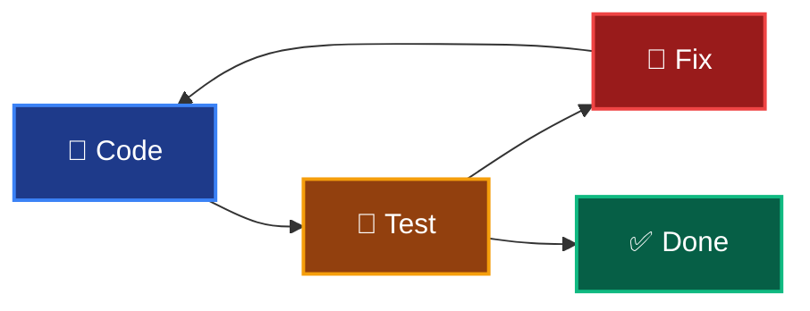

My experience with AI has been that it augments my abilities. It can consolidate
information and automate tedium to make me more productive. For more
sophisticated tasks related to programming, AI cannot replace a hardworking and
fully engaged engineer.

Some people might feel like we're at a moment like this:

<!-- https://x.com/RyanEls4/status/1879978018204184582 -->



I've seen software engineers sometimes get defensive on the topic of AI, because
they are perturbed by these sorts of unrealistic soundbites. Similar
melodramatic sentiments are rampant on LinkedIn. I've been grateful to work with
other engineers who have a strong interest in productivity and are level-headed
and honest about AI.

The reality is somewhere between the extremes. AI isn't replacing engineers, but
it will also fundamentally change how we work. When used thoughtfully, it can
genuinely accelerate development workflows by taking on specific, well-defined
roles in the programming process.



## Usage

In my currently evolving workflows, AI fulfills a burgeoning role to augment my
work with discovery and agentic iteration.

### Discovery

Discovery is my favorite use case for AI. Being able to quickly traverse and
reference large amounts of information has made me feel resourceful and
effective.

Just talk to your repository with questions like "What are the side effects of
this module?" or "Show me all the places where authentication is handled." I
frequently use this to understand hotspots in code and trace dependencies before
making changes.

Well-structured codebases with clear boundaries are easier for both humans and
AI to navigate. When I refactored a large codebase using
[Context Boundaries](/boundary) for team scalability, it also improved AI's
ability to provide focused, relevant insights by confining context to specific
code subdivisions.

This raises an important design question as we integrate AI into development
workflows:

> How can we improve code organization for both human and AI readability?

The answer benefits onboarding, knowledge transfer, and debugging regardless of
whether you're working with human teammates or AI assistants.

### Agentic iteration

```mermaid
flowchart LR
    A[🤖 Code] --> B[🧪 Test]
    B --> C[🔧 Fix]
    C --> A

    B --> D[✅ Done]

    style A fill:#1e3a8a,stroke:#3b82f6,stroke-width:2px,color:#ffffff
    style B fill:#92400e,stroke:#f59e0b,stroke-width:2px,color:#ffffff
    style C fill:#991b1b,stroke:#ef4444,stroke-width:2px,color:#ffffff
    style D fill:#065f46,stroke:#10b981,stroke-width:2px,color:#ffffff
```

LLMs are most effective with iterative feedback. Developing good checks and
tests provide guidance to the coding agents and validate their work.

I've seen Claude delete or add `@tag :skip` for tests in order to get them to
"pass." Engineers have to be hands-on conductors.

## Caution

Some LLMs use excessive
[validation and praise](https://github.com/anthropics/claude-code/issues/3382).



[OpenAI's AMA](https://www.reddit.com/r/ChatGPT/comments/1mkae1l/gpt5_ama_with_openais_sam_altman_and_some_of_the/)
for the GPT-5 release demonstrated that some users crave this sycophancy. We
need self-awareness about what using AI does to our psychology and good
reviewing practices to instability in our code.

<!-- https://x.com/Steve8708/status/1856896071433424982 -->



I saw a coworker publish a PR with invalid code and blame AI. People are
accountable for code. AI can't be accountable.

There doesn't need to be a major paradigm shift in best practices. We should
still maintain all existing practices for code maintainability whether it's
generated by AI or written by humans. For example, of course we should be
concerned about what code AI writes. The same is true when we select libraries
or languages without AI. In both cases we own the decision and the code. Age-old
best practices continue even with modern AI technology.

## What's next?

As LLMs and the tooling evolve, so do my workflows. I'm continuing to learn and
grow with these changes. My
[dotfiles](https://github.com/brettinternet/dotfiles) are rapidly changing to
reflect changes in agentic tooling.

Can engineers become excessively reliant on agentic prompting? Will this change
engineering culture? What will this mean especially for newer programmers in the
field?

Will LLM innovation begin to plateau? I wonder if we're nearing a point where
throwing more compute or a longer chain of thought won't yield additional gains
in performance.

For now, AI can augment software engineering in meaningful ways. I encourage
software engineers to discover what LLMs can do for their productivity.

AI isn't going to replace thoughtful engineering, but it can make thoughtful
engineers more effective. The key is approaching it as a sophisticated tool that
excels in specific contexts such as code completion, research and discovery,
focused updates, and iterative problem-solving. As the technology evolves, so
should our practices for integrating it responsibly into development workflows.

---

This post was adapted from a [lightning talk](https://brett.cloud/slides/ai/) I
gave to a company leadership meeting.
