My experience with AI has been that it augments my abilities. It can consolidate information and automate tedium to make me more productive. For more sophisticated tasks related to programming, AI cannot replace a hardworking and fully engaged engineer.

Some people might feel like we're at a moment like this:

<!-- https://x.com/RyanEls4/status/1879978018204184582 -->


And we could be. But, we're absolutely not at a moment like this:

<!-- https://x.com/amritwt/status/1941460667946713311 -->


Then, there's this:

<!-- https://x.com/paulg/status/1953289830982664236 -->


Who in this scenario is actually confirming that it's not 10k lines of slop?

I've seen software engineers sometimes get defensive on the topic of AI, because they are perturbed by these sorts of unrealistic soundbites. Similar melodramatic sentiments are rampant on LinkedIn. I've been grateful to work with other engineers that have a strong interest in productivity and are level-headed about AI.

The reality is somewhere between the extremes. AI isn't replacing engineers, but it's also not just a fancy autocomplete. When used thoughtfully, it can genuinely accelerate development workflows by taking on specific, well-defined roles in the programming process.

## Usage

In my currently evolving workflows, AI fulfills a few very specific pair programming roles to augment my work:

1. Code completions
1. Discovery
1. Surgical updates
1. Iterative edit-test loops

There are MCP servers that assist with most of these roles. I have [some I'm working on](https://github.com/brettinternet/mcp) and [a few I use](https://github.com/brettinternet/ai) regularly.

### 1. Code completions

This is the most obvious pair programming application for AI.





These are extremely context-aware changes and combat small-scale tedium.

### 2. Discovery

Discovery is my favorite usecase for AI. I use it for researching topics, summarizing documentation, querying libraries and codebases, getting usage examples, and planning implementation approaches. This is where AI shines as a research assistant that can quickly traverse large amounts of information.

For codebase exploration, AI excels at answering questions like "What are the side effects of this module?" or "Show me all the places where authentication is handled." I frequently use this to understand hotspots in code and trace dependencies before making changes.

Well-structured codebases with clear boundaries are easier for both humans and AI to navigate. When I refactored a large codebase using [Context Boundaries](/boundary) for team scalability, it also improved AI's ability to provide focused, relevant insights by confining context to specific code subdivisions.

This raises an important design question as we integrate AI into development workflows:

> How can we improve code organization for both human and AI readability?

The answer benefits onboarding, knowledge transfer, and debugging regardless of whether you're working with human teammates or AI assistants.

### 3. Surgical updates

AI can accomplish more sophisticated tasks when it's steered towards a very specific context. I have a coworker that calls these "surgical updates". This is where you pave a precise path for the agent to make specific changes. You might build up a context from a discovery or planning stage with an agent. In large enterprise codebases, this is how you manage context.

<!-- https://x.com/vasumanmoza/status/1926487201463832863 -->


Writing code is rarely the bottleneck. The real challenges in software development are understanding requirements, designing systems, debugging complex interactions, and making architectural decisions. Even with AI assistance, these cognitive tasks require human judgment, domain expertise, and the ability to reason about trade-offs. AI can help you write code faster, but it can't replace the critical thinking needed to determine what code should be written in the first place.

Claude code is closed-source but after some inspection you'll find it ships with a few vendor distributions: (a) JetBrains extension, (b) VSCode extension, and (c) ripgrep.





[Ripgrep](https://github.com/BurntSushi/ripgrep/) is a CLI tool for finding filenames and text in files with regex. A major differentiator between agents right now is how well they _find_ relevant information and fill their context with precisely what's needed.

### 4. Iterative Edit-Test Loops

```mermaid
flowchart LR
    A[🤖 Code] --> B[🧪 Test]
    B --> C[🔧 Fix]
    C --> A

    B --> D[✅ Done]

    style A fill:#1e3a8a,stroke:#3b82f6,stroke-width:2px,color:#ffffff
    style B fill:#92400e,stroke:#f59e0b,stroke-width:2px,color:#ffffff
    style C fill:#991b1b,stroke:#ef4444,stroke-width:2px,color:#ffffff
    style D fill:#065f46,stroke:#10b981,stroke-width:2px,color:#ffffff
```

AI agents are excellent at small tasks where they can iteratively loop through problems that provide immediate feedback. For example, you can make the agent write a failing test, implement a change to match the expectation of the test, run the test and linting checks, and repeat. Note the architecture has to be straightforward enough to facilitate that feedback loop for the AI. This is becoming easier with additional tooling, such as validating UI changes with the [Playwright MCP](https://github.com/microsoft/playwright-mcp).

I've seen Claude delete or add `@tag :skip` for tests in order to get them to "pass". Engineers have to be hands-on conductors. However, AI agents are excellent at setting up tests and other boilerplate and iterative test-driven development–just be sure to review that the coverage is meaningful.

## Best Practice

### Workflow

Using an AI agent for development looks unique for different tasks. Let me lay out a very general workflow with agentic prompting and some ideas to guide our approach.

1. Create worktree as a sibling folder to `work/repo-name` to parallelize working on a repository
1. Use Linear MCP to examine specifications of a ticket
1. Investigate the work in parallel with the agent in main worktree, ask the agent for an execution plan and then analyze the plan
1. Run a first pass on the work and write tests for our expectations (or inverse order)
1. Review the work, refactor or fill in the gaps

### Caution

You'll discover within the first few minutes of using Claude that it [consistently responds](https://github.com/anthropics/claude-code/issues/3382) with this praise:

> You're absolutely right!





There was a GPT 4o update a few months ago where OpenAI released a personality update that was intensely sycophantic and mirrored user language. [OpenAI's AMA](https://www.reddit.com/r/ChatGPT/comments/1mkae1l/gpt5_ama_with_openais_sam_altman_and_some_of_the/) for the GPT5 release had users begging for the return of the 4o user engagement maximizer because it was "friendly".

We need self-awareness about what using AI does to our psychology and good reviewing practices to avoid problematic code getting onto `main`.

<!-- https://x.com/Steve8708/status/1856896071433424982 -->


I noticed a coworker published a PR for review that had invalid code and the engineer blamed it on AI.
People are accountable for code. AI can't be accountable.

There doesn't need to be a major paradigm shift with best practice. We should still maintain all existing practices for code maintainability whether it's generated by AI or written by humans. For example, of course we should be concerned about what code AI writes. The same is true when we select libraries or languages without AI. In both cases we own the decision and the code. Age old best practice continue even with modern AI technology.

## Open Questions

As LLMs and the tooling evolves, so do my workflows. I'm continuing to learn and grow with these changes. My [AI repo](https://github.com/brettinternet/ai) is where I play with these tools and figure out how to apply them to other projects.

Can engineers become excessively reliant on agentic prompting? Will this change engineering culture? What will this mean especially for newer programmers in the field?

Will LLM innovation will begin to plateau? I wonder if we're nearing a point where throwing more compute or a longer chain of thought won't yield additional gains in performance.

Are Anthropic and OpenAI subsidizing access to their models and will prices skyrocket soon? GPT5 appears to have been a cost-saving exercise for several reasons.

For now, AI can augment software engineering in meaningful ways and I encourage every software engineer to discover what LLMs can do for your workflows.

## Conclusion

AI isn't going to replace thoughtful engineering, but it can make thoughtful engineers more effective. The key is approaching it as a sophisticated tool that excels in specific contexts such as code completion, research and discovery, focused updates, and iterative problem-solving. As the technology evolves, so should our practices for integrating it responsibly into development workflows.

---

This post was adapted from a [lightning talk](https://brett.cloud/slides/ai/) I gave recently to a group of executives.
