I think we could be at a moment like this:

<!-- https://x.com/RyanEls4/status/1879978018204184582 -->


However, I don't think we're at a moment like this:

<!-- https://x.com/amritwt/status/1941460667946713311 -->


## Usage

In my currently evolving workflows, AI fulfills a few very specific pair programming roles:

1. Code completions
1. Discovery
1. Surgical updates (steer towards specific context)
1. Iterative edit-test loops

### Code completions

This is the most obvious pair programming application for AI. It's extremely context-aware changes and combat small-scale tedium.





Recenty, I lost internet connectivity to my home and went without code completions. I wasn't inhibited but I could feel the difference without this feature.

### Discovery

Discovery is my favorite usecase for AI. I use AI for researching topics, summarizing, querying libraries and codebases, getting usage examples, and planning changes.

Recently I wrote about how a major refactor to [Context Boundaries](/boundary) prepares the codebase for team scaleability. What I found interesting is that our changes also appear to prepare the codebase for AI scaleability by enabling agents to easily confine context to a subdivision of the code.

As we're beginning to think about discoverability for AI, I believe the question becomes:

> How can we improve readability for both humans and AI?

This is a huge lift on onboarding engineers and understanding code. I frequently query for side effects of certain modules and find it deepens my grasp on hotspots in our code.

### Surgical updates

I have a coworker that calls these "surgical updates". This is where you pave a precise path for the agent to make specific changes. You might build up a context from a discovery or planning stage with an agent. In large enterprise codebases, this is how you manage context.

<!-- https://x.com/vasumanmoza/status/1926487201463832863 -->


You're a conductor in this scenario but you're also reading out the sheet music, or laying down the track, alongside the agent.

Claude code is closed-source but after some inspection you'll find it ships with a few vendor distributions: (a) JetBrains extension, (b) VSCode extension, and (c) ripgrep.





[Ripgrep](https://github.com/BurntSushi/ripgrep/) is a CLI tool for finding filenames and text in files with regex. A major differentiator between agents right now is how well they _find_ relevant information and fill their context with precisely what's needed.

### Iterative Edit-Test Loops

```mermaid
flowchart LR
    Code[🤖 Generate Code] --> Test[🧪 Run Tests]
    Test --> Fix[🔧 Fix Issues]
    Fix --> Code

    Test --> Done[✅ Success]

    style Code fill:#e3f2fd
    style Test fill:#fff3e0
    style Fix fill:#ffebee
    style Done fill:#e8f5e8
```

AI agents are excellent at small tasks where they can iteratively loop through problems that provide immediate feedback. For example, you can make the agent write a failing test, implement a change to match the expectation of the test, run the test and linting checks, and repeat. Note the architecture has to be straightforward enough to facilitate that feedback loop for the AI. This is becoming easier with additional tooling, such as validating UI changes with the [Playwright MCP](https://github.com/microsoft/playwright-mcp).

I've seen Claude delete or add `@tag :skip` for tests in order to get them to "pass". You have to exercise caution. Engineers have to be hands-on conductors. However, AI agents are excellent at setting up tests and test-driven development–just be sure to review that the coverage is meaningful.

## Best Practice

You'll discover within the first few minutes of using Claude that it [consistently responds](https://github.com/anthropics/claude-code/issues/3382) with this praise:

> You're absolutely right!





The glazing is bad. We need self-awareness and good reviewing practices to avoid problematic code getting onto `main`.

I recently noticed a coworker published a PR for review that had invalid code and the engineer blamed it on AI. Fingerpointing at the agent isn't acceptable.

<!-- https://x.com/Steve8708/status/1856896071433424982 -->


People are accountable for code. AI can't be accountable.

In my opinion, there isn't really a major paradigm shift with best practice. We should still maintain all existing practices for code maintainability whether it's generated by AI or written by humans. For example, of course we should be concerned about what code AI writes. The same is true when we select libraries or languages without AI. In both cases we own the decision and the code. Age old best practice continue even with modern AI technology.

## AI Playground

As LLMs and the tooling evolves, so do my workflows. I'm continuing to learn and grow with these changes. My [AI repo](https://github.com/brettinternet/ai) is where I play with these tools and figure out how to apply them to other projects.

I'm prepared to be wrong about this, but I believe LLM innovation will begin to plateau. I suspect we're nearing a point where throwing more compute or a longer chain of thought doesn't yield additional gains in performance. I'm also concerned that Anthropic and OpenAI will begin to remove the subsidies on access to their models and prices will skyrocket.
