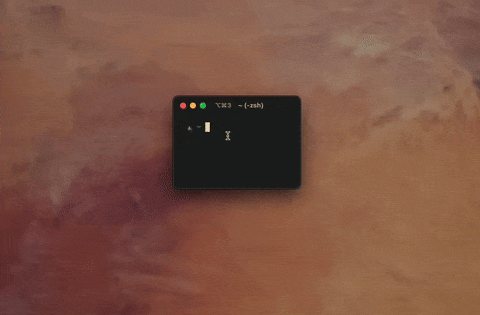
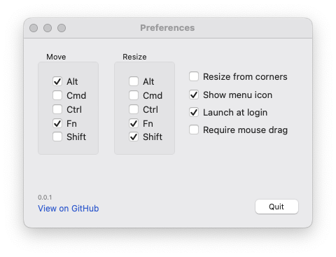



  

<h1 align="center">Appresize</h1>


[Appresize](https://github.com/brettinternet/Appresize) is a utility to resize and move apps from anywhere on the window with custom modifiers and other preferences.









One of my favorite abandonware apps on macOS was an old closed-source Objective C application called [Hyperdock](https://bahoom.com/hyperdock) that had a small secondary feature to resize and move windows by a modifier from anywhere on the window.

There are various window utilities on Mac, but none of them satisfied my very specific expectation. Now, this demand lives on with Swift in a small utility [here](https://github.com/brettinternet/Appresize).
