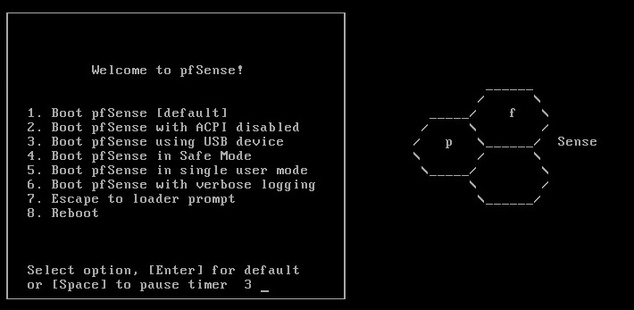
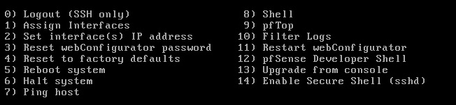

Firewall software might seem like a peculiar resource for a web developer to use, but I've found it to be an essential item on my developer tool belt. Protecting your network interface is a critical section in this popular write-up [Security 101](https://github.com/forter/security-101-for-saas-startups/blob/english/security.md#antivirusfirewall). OpenVPN, reverse proxy, traffic watch, and other addons make pfSense part of my personal DevOps.

I used to work closely with a company's sysadmin in a previous job.
Together with his help and some extensive research, I was able to harness a few of the wonderful open source tools that [pfSense](https://www.pfsense.org/) bundles together.
The [community](https://forum.pfsense.org/) is full of intelligent professionals. As with all technical forums, entry-level participation can be intimidating. Networking is also a difficult subject to learn and harder to practice, but I use my own home network as a playground to implement some concepts. While pfSense is indeed enterprise-level software, this walkthrough is for hobbyists.

<figcaption>I can monitor the router hardware from the pfSense dashboard</figcaption>

## Hardware

I'm using a retired, old computer from a previous job, but a bottle of canned air knocked off a couple of years from the old bulky metal frame.
This junker has two cores and 4GB of DDR3 RAM, but I've never had any issues with it on my gigabit network.
It's big for what it does, so an Intel NUC might be better if space is a concern. The hardware requirements are minimal, but pfSense does offer [some recommendations](https://www.pfsense.org/hardware/#requirements) and **dual NICs are required**&mdash;you _must_ have two ethernet ports for LAN and WAN.

I've chosen to add an additional spindle disk for parity, but backing up your firewall config is very easy so this isn't necessary.
Together with this inexpensive [TP-Link NIC](https://www.amazon.com/gp/product/B003CFATNI/ref=oh_aui_search_detailpage?ie=UTF8&psc=1) and a [network switch](https://www.amazon.com/NETGEAR-GS105NA-Ethernet-Replacement-Unmanaged/dp/B0000BVYT3/), my old machine has been sufficient hardware for what I need.
Eventually, when I can afford to graduate my servers to a server rack, I'll upgrade my firewall to a small, 1U case.

## Software

The pfSense software is free and open source. You can [download it here](https://pfsense.org/download/) for your specific build and the easiest install is with a USB. Use [rufus](https://rufus.akeo.ie/), [etcher](https://github.com/resin-io/etcher/) or [unetbootin](http://unetbootin.github.io/) to write the image to your USB.

### Setup

The ultimate [pfSense installation guide](https://doc.pfsense.org/index.php/Installing_pfSense) is by the creators themselves on their wiki. But I'll walk through my process here.

Plug in your USB and boot up your machine. To enter the boot options menu, you usually press DEL, F8 or F12 as the BIOS splash screen appears depending on your hardware. You should then see the following screen:

<figcaption>pfSense installation menu</figcaption>

Select `1` to begin the installation.
Then, press `i` to launch the installer. In the following screens let's go with the default configurations: `Accept these Settings`, then choose `Quick/Easy Install`.
If you're an advanced user, you'd use 'Custom Install' to choose which disk to install to and partitioning setup.
Continue through the setup and confirm the request to format and write your disk.

Once the partitions are created and the kernel is installed, you'll be prompted to reboot.
You can now eject your USB installer. When your pfSense machine reboots, you'll now be prompted to setup your network interfaces.
The first option is for `VLAN` setup, but generally VLANs are for advanced networking and we don't need it here.

Next, you'll set your `WAN` and `LAN` interfaces.
Depending on your hardware, these interfaces can have different names--your interfaces may look like `em0`, `em1` or `bge0`, `ce0`.
You'll need to assign the correct interface to the WAN and the other to the LAN interface.
Select the appropriate options and follow the prompts.

After setting up your network interfaces, you'll now see an options menu on the CLI with numbers 1 through 14 or 15.
If you set up the interfaces correctly, you'll see WAN and LAN IP addresses.
You should also see an `http://` IP address which you can access on the LAN network to view the pfSense GUI.
The default username and password should be `admin` and `pfsense`. If not, [refer to the docs](https://doc.pfsense.org/index.php/Installing_pfSense) for the latest credentials.
You should walk through the setup wizard to complete the installation.

I'll go over usage and some extra packages that I use with pfSense in the [next post]().
