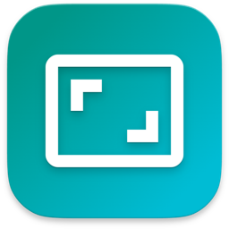



  

<h1 align="center">HyperWindow</h1>


[HyperWindow](https://github.com/brettinternet/HyperWindow) is a macOS utility
for resizing and moving windows from anywhere with custom modifiers and other
preferences.





One of my favorite abandonware apps on macOS was an old closed-source
Objective-C application called [Hyperdock](https://bahoom.com/hyperdock) that
had a small secondary feature to resize and move windows with a modifier from
anywhere on the window.

There are various window utilities on Mac, but none of them satisfied my very
specific expectation. Now, this demand lives on with Swift in a small utility
[here](https://github.com/brettinternet/HyperWindow).
