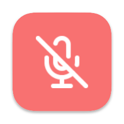
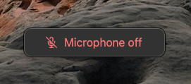



  

<h1 align="center">Mic Mute for macOS</h1>


[Mic Mute](https://github.com/brettinternet/mic-mute) is a system-wide mute for
macOS with a global shortcut and a clear visual indicator. It's inspired by
[VCM](https://learn.microsoft.com/en-us/windows/powertoys/video-conference-mute)
for Windows.

Mute with the shortcut  <kbd>Cmd</kbd> <kbd>Shift</kbd> <kbd>A</kbd>
 or from the system tray dropdown menu.





The mute indicator window will follow the cursor to desktops or screens and
monitors. The system tray icon will also indicate the mute status. Once
microphones are on again, the window will hide.


