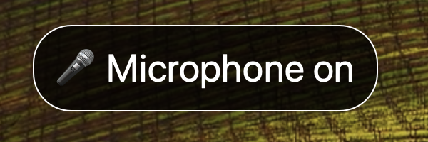
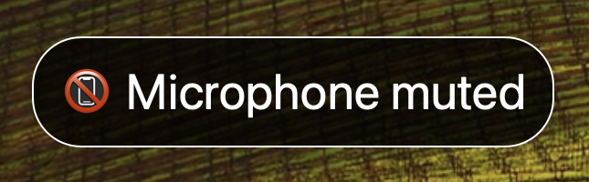



<div class="flex justify-center">
  
</div>

<h1 align="center">Mic Mute for macOS</h1>


[Mic Mute](https://github.com/brettinternet/mic-mute) is a system-wide mute for
macOS with a global shortcut and a clear visual indicator. It's inspired by
[VCM](https://learn.microsoft.com/en-us/windows/powertoys/video-conference-mute)
for Windows.

Mute with the shortcut  <kbd>Cmd</kbd> <kbd>Shift</kbd> <kbd>A</kbd>
 or from the system tray dropdown menu.





The mute indicator window will follow the cursor to desktops or screens and
monitors. The system tray icon will also indicate the mute status. Once
microphones are on again, the window will hide.
[View releases](https://github.com/brettinternet/mic-mute/releases).

## Update: What I use now

My journey finding the best solution for this has evolved. I now use
[Hammerspoon](https://www.hammerspoon.org) which is a delightful way to hack
together MacOS scripts. The Lua scripting in Hammerspoon makes maintaining this
a lot more fun than foreign functions in Rust. I'm still able to use the hotkey
`⌘ ⇧ A` and I've also mapped it to a macropad that uses `F13`. My script also
supports Push To Talk.

Muted and unmuted indicators:



<div class="flex flex-row items-center">


</div>


Here's the solution:

```lua
muteAlertId = nil
-- Clear the alert if exists to avoid notifications stacking
local function clearMuteAlert()
  if muteAlertId then
    hs.alert.closeSpecific(muteAlertId)
  end
end

-- Hold the hotkey for Push To Talk
local holdingToTalk = false
local function pushToTalk()
  holdingToTalk = true
  local audio = hs.audiodevice.defaultInputDevice()
  local muted = audio:inputMuted()
  if muted then
    clearMuteAlert()
    muteAlertId = hs.alert.show("🎤 Microphone on", true)
    audio:setInputMuted(false)
  end
end

-- Toggles the default microphone's mute state on hotkey release
-- or performs PTT when holding down the hotkey
local function toggleMuteOrPTT()
  local audio = hs.audiodevice.defaultInputDevice()
  local muted = audio:inputMuted()
  local muting = not muted
  if holdingToTalk then
    holdingToTalk = false
    audio:setInputMuted(true)
    muting = true
  else
    audio:setInputMuted(muting)
  end
  clearMuteAlert()
  if muting then
    muteAlertId = hs.alert.show("📵 Microphone muted")
  else
    muteAlertId = hs.alert.show("🎤 Microphone on")
  end
end

-- `⌘ ⇧ A` but you could also map to F13 for a macropad
hs.hotkey.bind({"cmd", "shift"}, "a", nil, toggleMuteOrPTT, pushToTalk)
```

Hammerspoon also makes it incredibly easy to add other utilities, such as making
a hotkey to change the default audio output or input. Find the latest
[source in my dotfiles](https://github.com/brettinternet/dotfiles/tree/9ff9cdaba6358b16fc0efa4f2fd3f0617f038dcb/mac/.hammerspoon).


