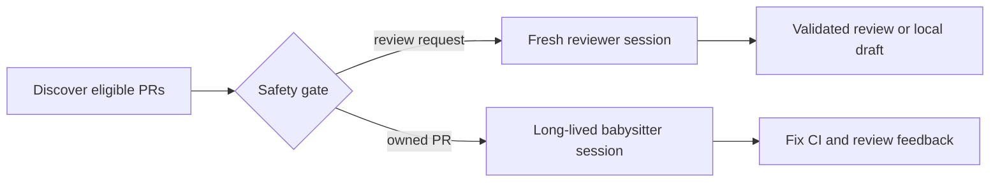

[PR Watch](https://github.com/brettinternet/pr-watch) is an experiment in using
agent orchestrators to watch pull requests and help authors refine their work. I
built the same two workflows on two runtimes:
[Gas City](https://github.com/gastownhall/gascity) and
[CAO](https://github.com/awslabs/cli-agent-orchestrator).

Rather than using an agent to orchestrate, the workflows programmatically search
pull requests and react to them by setting up tooling, bare clones, and
additional context. The first workflow finds pull requests that need my review
and starts a clean review for the current head revision. The second watches my
open pull requests with agent instructions to keep CI green, handle review
feedback, and request approval from an optional reviewer.

CAO has been the better fit. Its project-local server, profiles, sessions, work
directories, and dashboard make the long-running agent model easier to reason
about and inspect. The setup is also a straightforward interface for a task
runner instead of a collection of custom process glue.

The automation still has hard limits. Pull-request titles, diffs, comments,
logs, and linked content are untrusted. Reviewers only publish validated
reviews. Babysitters can make small verified fixes and push to the PR branch,
but cannot merge, force-push, dismiss reviews, or approve for someone else.

In CAO, you have workflows that inherit an environment with agents running in
OpenCode, in a terminal multiplexer like Herdr, between python scripts, in a web
dashboard. It sounds like spaghetti but it actually comes together very nicely.


