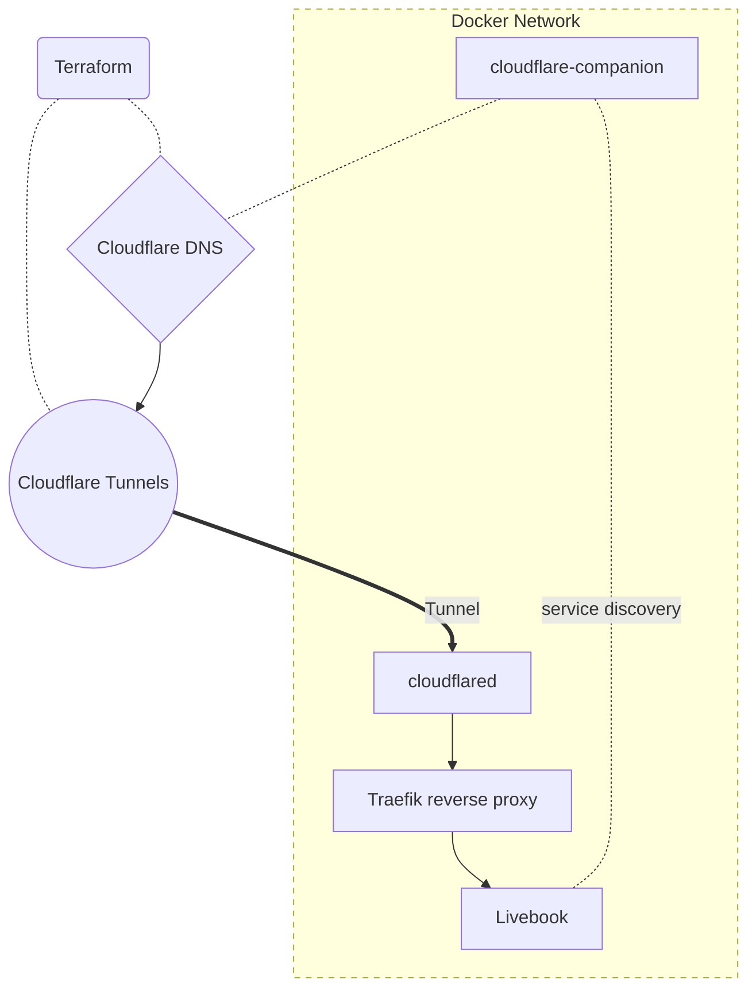

Remember the old iPhone commercial from the late 2000s which introduced Apple's
AppStore with the phrase, "There's an app for that"? That's how open source
services are now. There's a wide selection of useful and mature software that
containerization has made exceptionally portable.

My own [homelab](/homelab) has become a monorepo of DevOps overkill, but
self-hosting can be simple and easy with Docker. You can securely host
applications with a cheap desktop in your home with minimal effort and a single
docker-compose configuration file.

## Demo

I've set up a
[simple demo to host an application](https://github.com/brettinternet/docker-compose-hosted-demo).

Docker compose offers a very simple way to run and maintain self-hosted homelab.
The configuration is portable, easy to understand, and a container orchestration
can be run on a single node with just one command. As I demonstrate here, the
available tooling makes DNS and proxying automation and the service setup very
easy.

This demo hosts a simple Elixir notebook application called Livebook. I work in
an Elixir shop where Livebook is a local favorite. Livebook uses notebooks
similar to Python's Jupyter except it's built with Elixir and has real-time
syncing between clients because it's built on the Phoenix framework's library
[LiveView](https://hexdocs.pm/phoenix_live_view/Phoenix.LiveView.html).

This demo will set up a Cloudflared tunnel connection, a Traefik reverse proxy
and the Livebook app. Cloudflare DNS is automated with CNAME creation from
Traefik routes. There's no port forwarding required to host this app on a domain
you own.

Here's a sketch of the architecture:





The phony make targets below are used to simplify each step. Look at the
[Makefile](https://github.com/brettinternet/docker-compose-hosted-demo/blob/main/Makefile)
to see what each one does.

### Setup

First, initialize the config file and terraform project.

```sh
make setup
```

This creates a `.env` file which you should edit with your own secrets.
`CLOUDFLARE_API_TOKEN` needs Zone.DNS and Account.Cloudflare Tunnel write
permissions for the domain in use. Use an API token, not an API key. The value
for `CLOUDFLARE_TUNNEL_TOKEN` will come later.

Then, create the Cloudflared tunnel. You'll need Terraform, unless you create it
from the [Cloudflare Zero Trust dashboard](https://one.dash.cloudflare.com/).
Note, using the dashboard setup, point the tunnel endpoint to
`http://traefik:80` as the cloudflared image sees the host within the docker
network.

```sh
make terraform
```

This plans and applies the terraform tunnel configuration. It creates a CNAME
record tunnel.example.com that points to the Cloudflared tunnel URL.

Find the `tunnel_token` value in the terraform output file
`./tunnel/terraform.tfstate` and add it as the value of
`CLOUDFLARE_TUNNEL_TOKEN`.

### Run

Start the docker compose.

```sh
make start
```

This runs `docker-compose --compatibility up`. The compatibility flag appears to
be required in order to
[set resource limits in docker-compose](https://github.com/docker/compose/issues/4513).

## You can self-host

Self-hosting is a satisfying hobby with amazing utility. These methods also
provide ways to try out new technologies, host a simple blog, or make use of
existing services that you find on GitHub. Let me know if the demo has helped
you along with your own homelab.
