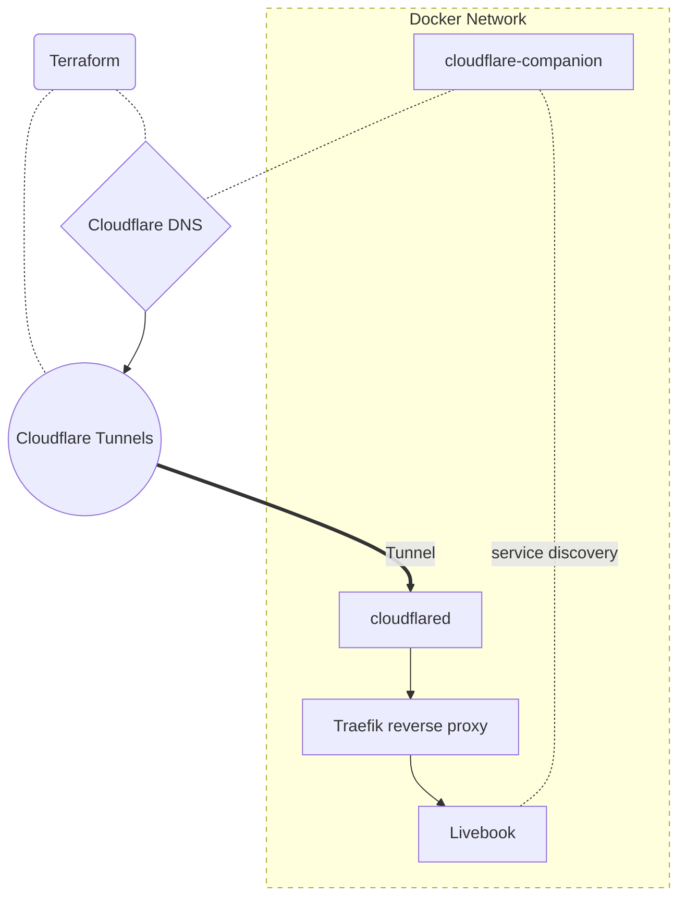

Remember the late-2000s iPhone commercial that introduced Apple's App Store with
the phrase, "There's an app for that"? That's what open-source services are like
now. There's a wide selection of useful and mature software that
containerization has made exceptionally portable.

My own [homelab](/homelab) has become a monorepo of DevOps overkill, but
self-hosting can be simple with Docker. You can securely host applications on a
cheap desktop in your home with minimal effort and a single Docker Compose
configuration file.

## Demo

I've set up a
[simple demo to host an application](https://github.com/brettinternet/docker-compose-hosted-demo).

Docker Compose offers a simple way to run and maintain a self-hosted homelab.
The configuration is portable and easy to understand, and one command runs the
container orchestration system on a single node. The available tooling
simplifies DNS automation, proxying, and service setup.

This demo hosts a simple Elixir notebook application called Livebook. I work in
an Elixir shop where Livebook is a local favorite. Livebook uses notebooks
similar to Jupyter, but it's built with Elixir and supports real-time syncing
between clients through Phoenix's
[LiveView](https://hexdocs.pm/phoenix_live_view/Phoenix.LiveView.html).

This demo sets up a Cloudflared tunnel connection, a Traefik reverse proxy, and
the Livebook app. It automates Cloudflare CNAME records from Traefik routes. No
port forwarding is required to host this app on a domain you own.

Here's a sketch of the architecture:


```mermaid
graph TB
  tf(Terraform) -.- dns
  tf -.- argo
  dns{Cloudflare DNS} --> argo
  argo((Cloudflare Tunnels)) == Tunnel ==> cloudflared
  ddns -.- dns

  subgraph lan[Docker Network]
    style lan stroke-dasharray: 5 5
    cloudflared --> traefik[Traefik reverse proxy]
    traefik --> livebook[Livebook]
    ddns[cloudflare-companion] -. service discovery .- livebook
  end
```

The phony make targets below are used to simplify each step. Look at the
[Makefile](https://github.com/brettinternet/docker-compose-hosted-demo/blob/main/Makefile)
to see what each one does.

### Setup

First, initialize the config file and Terraform project.

```sh
make setup
```

This creates a `.env` file which you should edit with your own secrets.
`CLOUDFLARE_API_TOKEN` needs Zone.DNS and Account.Cloudflare Tunnel write
permissions for the domain in use. Use an API token, not an API key. The value
for `CLOUDFLARE_TUNNEL_TOKEN` will come later.

Then create the Cloudflared tunnel. Unless you create it from the
[Cloudflare Zero Trust dashboard](https://one.dash.cloudflare.com/), you'll need
Terraform. When using the dashboard, point the tunnel endpoint to
`http://traefik:80` because the cloudflared image sees the host within the
Docker network.

```sh
make terraform
```

This plans and applies the Terraform tunnel configuration. It creates a CNAME
record for `tunnel.example.com` that points to the Cloudflared tunnel URL.

Find the `tunnel_token` value in the Terraform output file
`./tunnel/terraform.tfstate` and add it as the value of
`CLOUDFLARE_TUNNEL_TOKEN`.

### Run

Start the Docker Compose stack.

```sh
make start
```

This runs `docker-compose --compatibility up`. The compatibility flag appears to
be required to
[set resource limits in docker-compose](https://github.com/docker/compose/issues/4513).

## You can self-host

Self-hosting is a satisfying hobby with amazing utility. These methods also
provide ways to try out new technologies, host a simple blog, or make use of
existing services that you find on GitHub. Let me know if the demo has helped
you with your own homelab.
