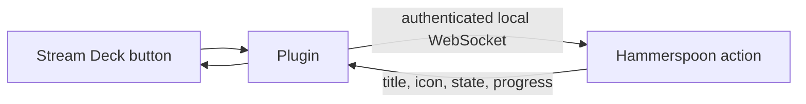

[Stream Deck and Hammerspoon](https://github.com/brettinternet/stream-deck-hammerspoon)
connects customizable Stream Deck buttons to Hammerspoon scripts. The Stream
Deck app still owns the hardware, so I can hack together scripts alongside
official Stream Deck plugins. Alternatively, the
[official Hammerspoon Stream Deck plugin](https://www.hammerspoon.org/docs/hs.streamdeck.html)
requires that the official Elgato Stream Deck app not be running.

The plugin supports buttons, toggles, and multi-state keys. Actions can also
update their title, color, icon, progress, badge, and transient success or error
state while they are visible.

The repository has a library of productivity actions to show off some of the
capabilities: start or stop a timer, control audio, run a script, launch an app
workflow, keep the Mac awake, display a system resource graph, or build a button
around any other Hammerspoon action.

The default connection is authenticated and local-only. LAN use is an explicit
opt-in with separate per-client keys.


