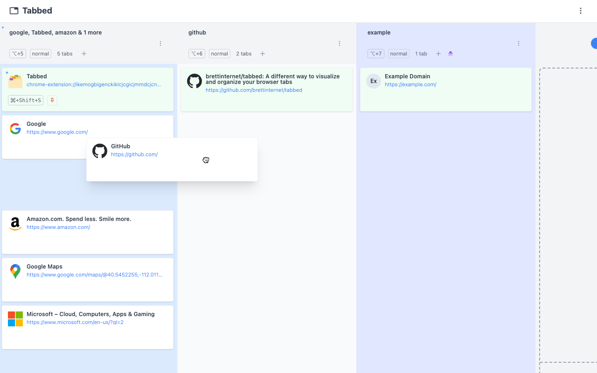



  

<h1 align="center">Tabbed</h1>


Tabbed is an experiment with a Chrome extension to visualize and organize
browser tabs.





Tabbed was built with accessibility in mind. See the full
[feature list and source](https://github.com/brettinternet/tabbed) or
[the latest releases](https://github.com/brettinternet/tabbed/releases).


