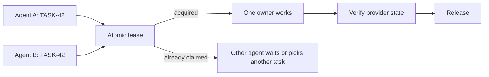

[Worklease](https://github.com/brettinternet/worklease) keeps two people or
agents from doing the same local work at once. It gives one contender a
short-lived lease for one exact resource. Everyone else waits, picks something
else, or tries again after the lease expires.

It is local coordination, not distributed locking, but resources can be remote
such as an issue tracker or backlog. The provider still decides what work exists
and whether it is complete.

## Where I use it

- Shared work queues: Two agents may see the same ready issue. A lease makes the
  local decision atomic before either creates a worktree or edits files.
- One expensive local resource: Serialize access to a GPU, a development port, a
  browser profile, a formatter, or anything else that should have one active
  owner.
- One destructive operation: Guard a migration, a release command, or any
  command that should not run twice on the same host.
- One source file: Claim a Markdown source such as a
  [backlog.md](https://backlog.md/) task and replace it only when its expected
  SHA-256 still matches.
- Several resources together: Lease an ordered bundle when one operation needs,
  for example, both a work item and a local port.

The CLI has explicit acquire, heartbeat, checkpoint, inspect, reconcile, and
release steps. Commands run through it receive receipts and bounded output. If
an operation has an unknown outcome, the caller stops and checks the
authoritative system instead of automatically repeating it.


