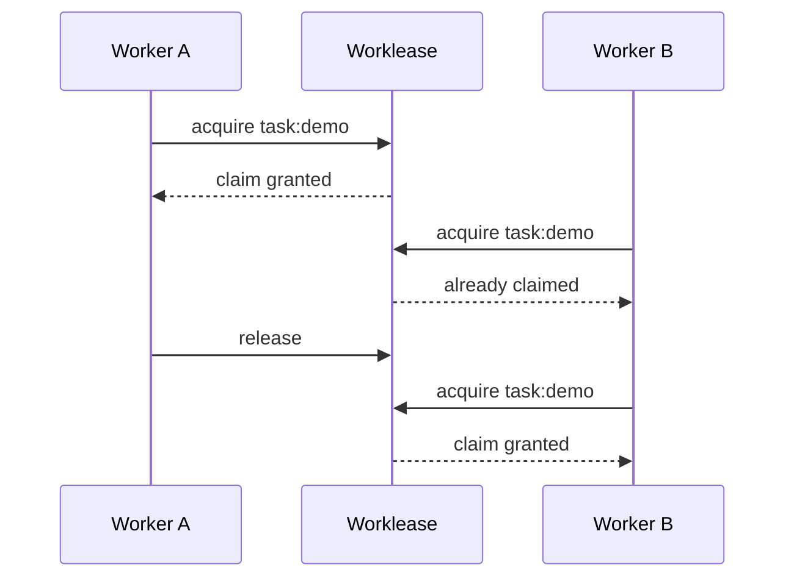

[Worklease](https://github.com/brettinternet/worklease) keeps two people or
agents from doing the same local work at once. It coordinates short-lived
ownership for one exact resource on the same host. Others can wait, choose
different work, or retry after the lease expires.

Worklease provides local coordination, not distributed locking. Resources may
represent remote work such as an issue or backlog item, but the provider remains
authoritative about what exists and whether it is complete.

## Where I use it

- Shared work queues: Claim an exact issue before creating a worktree or editing
  files.
- Expensive local resources: Serialize access to a GPU, development port,
  browser profile, formatter, or other host resource.
- Destructive commands: Guard migrations, releases, and recovery commands that
  must not run twice.
- Source-file updates: Claim a Markdown task and replace it only when its
  expected SHA-256 still matches.
- Coordinated operations: Claim 1–32 exact resources together when one operation
  needs a work item and a local port.

Claims have TTLs and support waiting, status, history, guarded commands, and
recovery. Ownership is backed by owner-private local SQLite authority. The
provider remains authoritative for remote work; local history is diagnostic, not
an audit trail.


