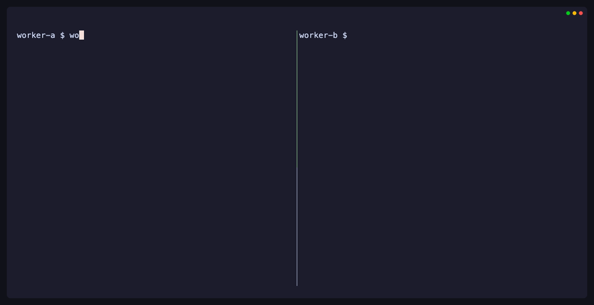
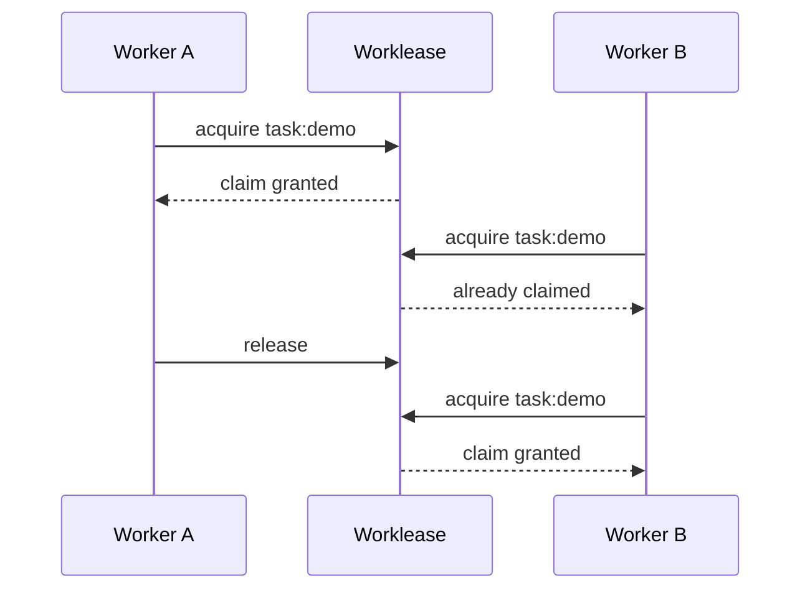

[Worklease](https://github.com/brettinternet/worklease) coordinates cooperating
coding agents working in separate local worktrees.

The backlog or provider remains authoritative. Worklease prevents local agent
loops from duplicating work by assigning temporary ownership with leases,
expiry, waiting, status, history, guarded commands, and recovery.

A lockfile protects a critical section for one process or file. Worklease
coordinates work across agents and supports ownership safely over time.


