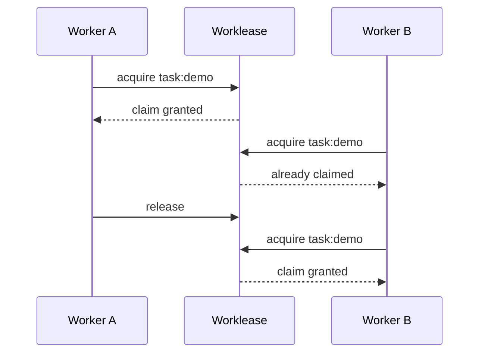
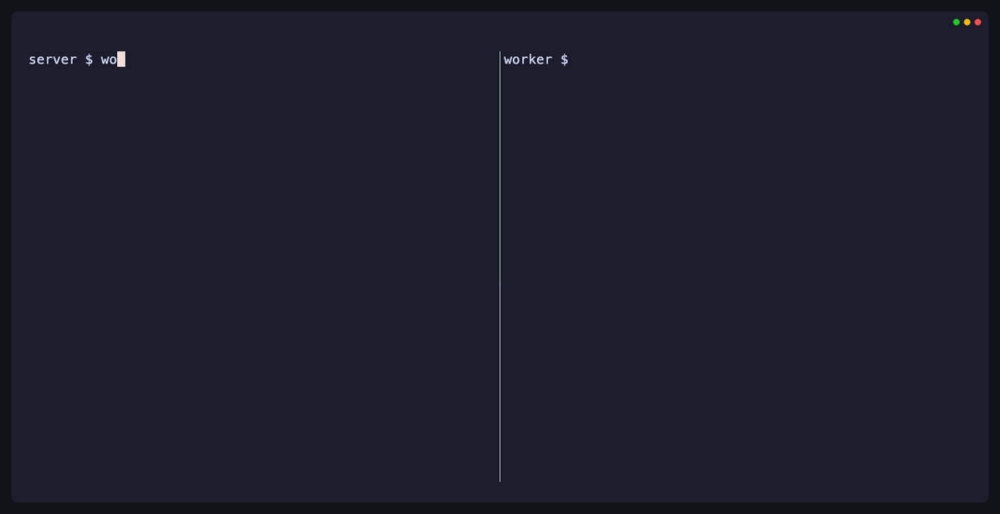

[Worklease](https://github.com/brettinternet/worklease) coordinates cooperating
coding agents across separate worktrees and distributed environments.

The backlog or provider remains authoritative. Worklease prevents agent loops
from duplicating work by assigning temporary ownership with leases, expiry,
waiting, status, history, guarded commands, and recovery.

A lockfile protects a critical section for one process or file. Worklease
coordinates work across agents and supports ownership safely over time. Its
server coordinates workers across machines.


