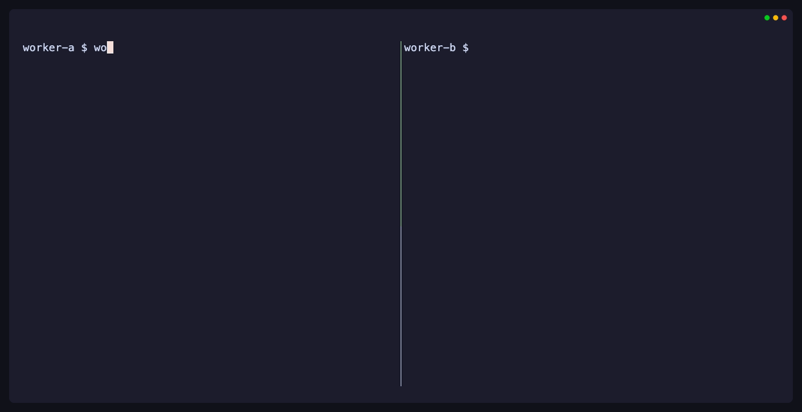
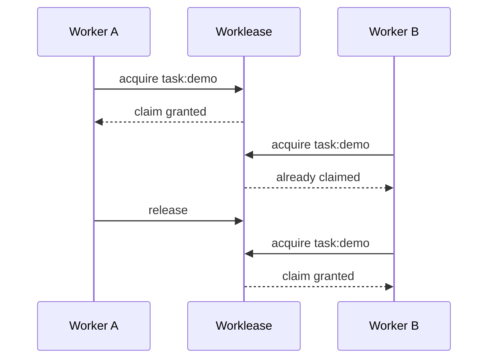
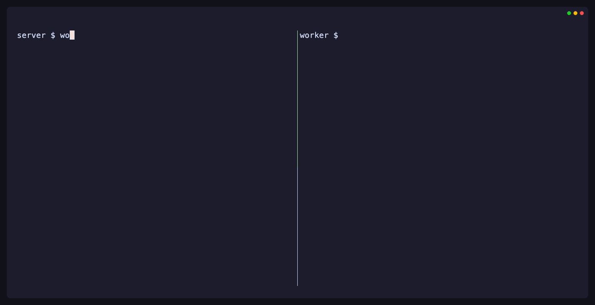
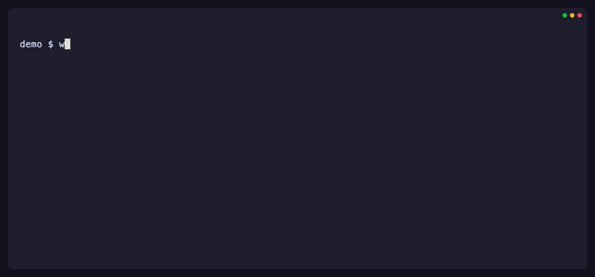

[Worklease](https://github.com/brettinternet/worklease) coordinates cooperating
coding agents across separate worktrees and distributed environments.

The backlog or provider remains authoritative. Worklease prevents agent loops
from duplicating work by assigning temporary ownership with leases, expiry,
waiting, status, history, guarded commands, and recovery.

```mermaid
sequenceDiagram
    participant A as Worker A
    participant W as Worklease
    participant B as Worker B
    A->>W: acquire task:demo
    W-->>A: claim granted
    B->>W: acquire task:demo
    W-->>B: already claimed
    A->>W: release
    B->>W: acquire task:demo
    W-->>B: claim granted
```

A lockfile protects a critical section for one process or file. Worklease
coordinates work across agents and supports ownership safely over time. Its
server coordinates workers across machines.

Run bare `worklease` to open the TUI and inspect, renew, or release claims.

## Features

- Claims with TTLs, heartbeats, waiting, and release reasons
- Guarded commands that run only while a claim is held
- Status, history, and recovery for expired or abandoned claims
- Local SQLite authority, or a remote authority with TLS and invites
- Work queue over GitHub Issues, Backlog.md, Beads, Linear, or a custom adapter
- TUI for browsing work and managing claims
- JSON output and an MCP server for agents


